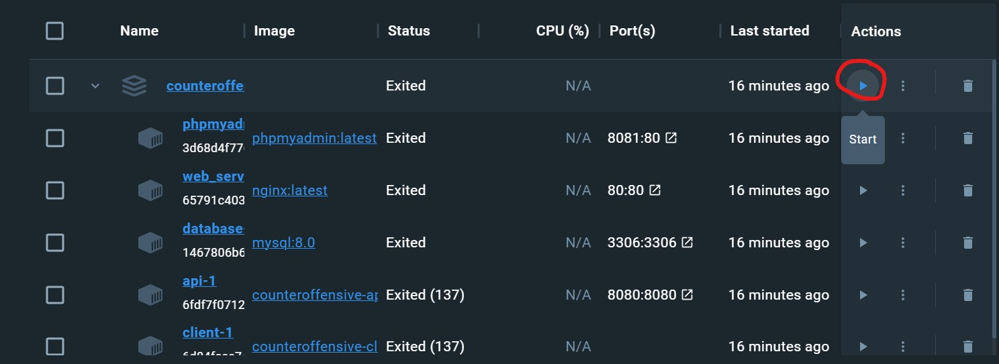
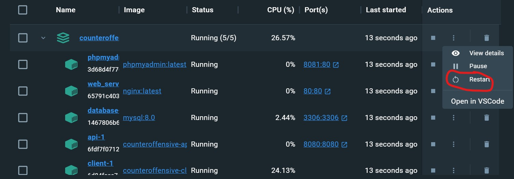

# Игра Контрнаступ (ContrNastup)
Браузерный 2д шутер про танки.

## Требуемые программы
Docker и дополнение Docker Compose

## Запуск проекта
Все команды нужно запускать в терминале в корневой папке проекта и при запущенном Docker Desktop

<<<<<<< HEAD
### Сборка
=======
<a name="build"></a>
### Сборка (Терминал)
>>>>>>> parent of 17b72fc ([ADD] Написал документацию к клиенту CLIENT.md)
```bash
docker compose build
```

<<<<<<< HEAD
### Запуск собранного проекта
=======
<a name="up"></a>
### Запуск собранного проекта
+ Терминал
>>>>>>> parent of 17b72fc ([ADD] Написал документацию к клиенту CLIENT.md)
```bash
docker compose up -d
```
<<<<<<< HEAD
=======

+ Docker Desktop

>>>>>>> parent of f4c5c8a ([FIX] Добавил картинку лога Docker Desktop в README.md)

<<<<<<< HEAD
### Перезапуск проекта
=======
<a name="restart"></a>
### Перезапуск проекта
+ Терминал
>>>>>>> parent of 17b72fc ([ADD] Написал документацию к клиенту CLIENT.md)
```bash
docker compose restart
```
<<<<<<< HEAD
=======

+ Docker Desktop

>>>>>>> parent of f4c5c8a ([FIX] Добавил картинку лога Docker Desktop в README.md)

<<<<<<< HEAD
### Остановка запущенного проекта
=======
<a name="stop"></a>
### Остановка запущенного проекта
+ Терминал
>>>>>>> parent of 17b72fc ([ADD] Написал документацию к клиенту CLIENT.md)
```bash
docker compose stop
```
<<<<<<< HEAD
=======

+ Docker Desktop

>>>>>>> parent of f4c5c8a ([FIX] Добавил картинку лога Docker Desktop в README.md)

## Использование проекта (информация по каждому контейнеру находится в папке documents. В скобочках файл с инструкцией)
Проект содержит 5 конейтеров:
1. database - База данных - MySQL (DB.md)
2. api - PHP server (SERVER.md, API.md)
3. client - React приложение (CLIENT.md)
4. phpmyadmin - PMA - Клиент для работы с БД (PMA.md)
5. web_server - Nginx (WEBSERVER.md)