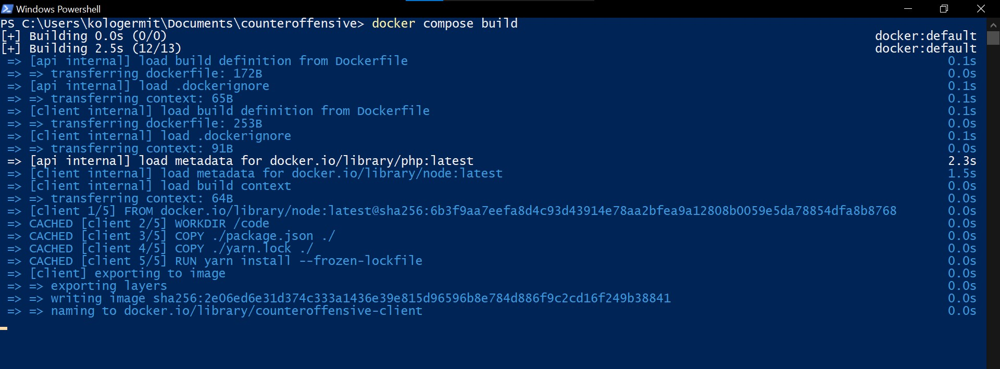
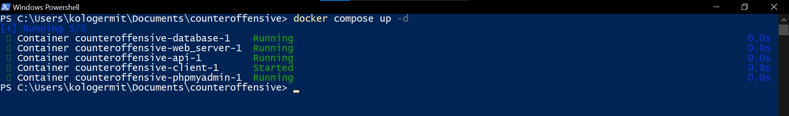
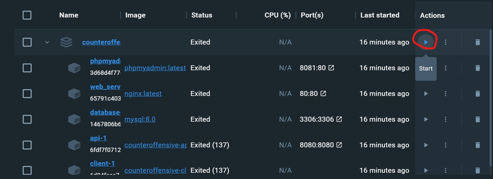
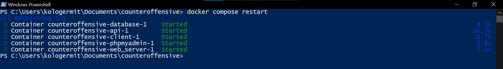
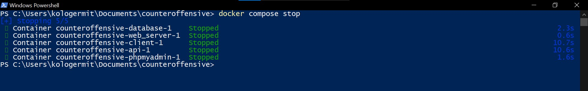
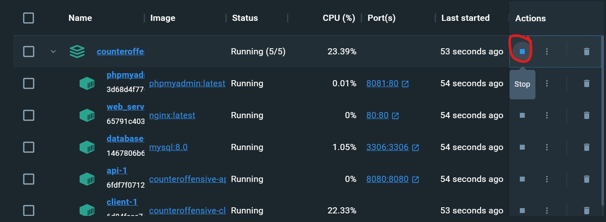
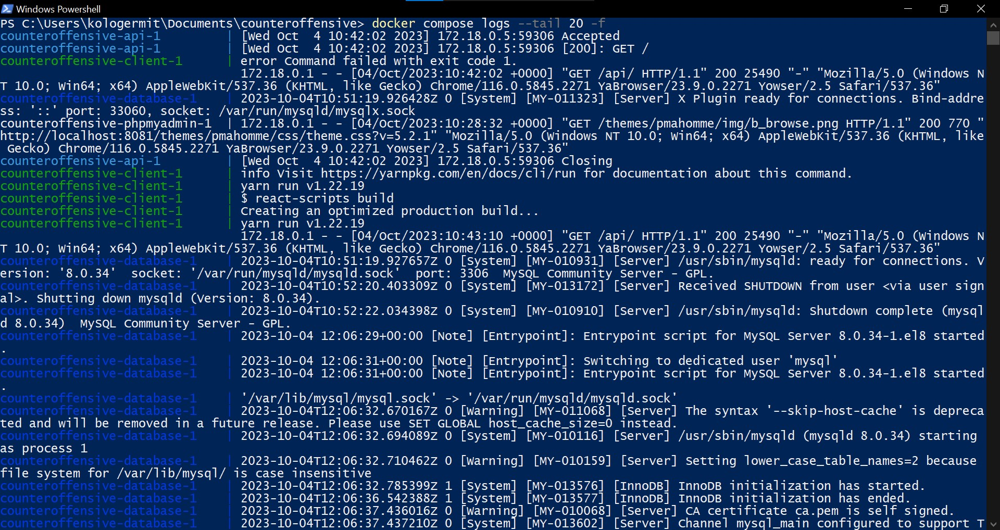
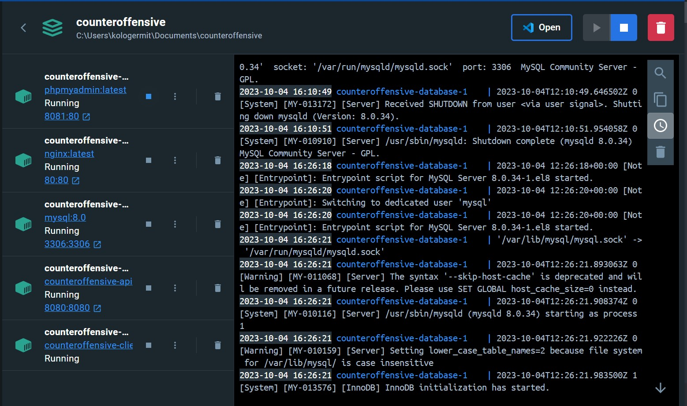

# Игра Контрнаступ (ContrNastup)
Браузерный 2д шутер про танки.

## Оглавление
+ [Требуемые программы](#required-programs)
+ [Запуск проекта](#start)
+ [Сборка](#build)
+ [Запуск собранного проекта](#up)
+ [Перезапуск](#restart)
+ [Остановка](#stop)
+ [Лог](#log)
+ [Контейнеры](#containers)
+ [Внутренние ссылки](#inside-links)

<a name="required-programs"></a>
## Требуемые программы
* [Docker](https://docs.docker.com/desktop/install/windows-install/) и дополнение Docker Compose (на Windows идёт из коробки)
* [NodeJS](https://nodejs.org/en/download)

<a name="start"></a>
## Запуск проекта
Все команды нужно запускать в терминале в корневой папке проекта и при запущенном Docker Desktop

<a name="build"></a>
## Сборка (Терминал из корневой папки)
* Сборка клиента
```bash
cd client
npm install
npm run build
cd ..
```
* Сборка проекта в Docker
```bash
docker compose build
```



<a name="up"></a>
## Запуск собранного проекта
+ Терминал
```bash
docker compose up -d
```

+ Docker Desktop


<a name="restart"></a>
## Перезапуск проекта
+ Терминал
```bash
docker compose restart
```

+ Docker Desktop


<a name="stop"></a>
## Остановка запущенного проекта
+ Терминал
```bash
docker compose stop
```

+ Docker Desktop


<a name="log"></a>
## Лог
+ Терминал (вывод последних 20 строчек)
```bash
docker compose logs --tail 20 -f
```

+ Docker Desktop


<a name="containers"></a>
## Контейнеры
Проект содержит 5 конейтеров:
1. database - База данных - MySQL ([DB.md](./documents/DB.md))
2. api - PHP server ([SERVER.md](./documents/SERVER.md), [API.md](./server/API.md))
3. phpmyadmin - PMA - Клиент для работы с БД ([PMA.md](./documents/PMA.md))
4. web_server - Nginx ([WEBSERVER.md](./documents/WEBSERVER.md))

<a name="inside-links"></a>
## Полезные ссылки внутри проекта:
1. Концепт проекта ([CONCEPT.md](./documents/CONCEPT.md))
2. Техническое задание ([TZ.md](./documents/TZ.md))
3. Чек-лист ([CHECK-LIST.md](./documents/CHECK-LIST.md))