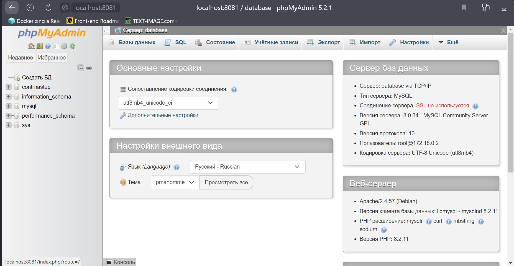

# База данных

## Docker Desktop
Контейнер называется **database** (*counteroffensive-database*)

## Подключение через браузер
<a href="http://localhost:8081/" target="_blank">http://localhost:8081/</a>(Подключение через PMA)

## Подключение через сторонние приложения
+ **Логин:** *admin*
+ **Пароль:** *b446b342-608c-11ee-8c99-0242ac120002*
+ **Хост:** *localhost*
+ **Порт:** *3306*
+ **База данных:** *contrnasup*

## Таблицы
+ **users** (Пользователи)
	|Имя|Тип|Описание|
	|-|-|-|
	|id|MEDIUMINT|Номер пользователей. В пустой базе первый пользователь будет равен 1, а все последующие больше на единицу|
	|login|VARCHAR(20)|Логин (ник/имя) пользователя. Длина от 4 до 20 символов|
	|password|VARCHAR(100)|Пароль пользователя. Хранится в хешированном формате. Алгоритм шифрования sha256|
	|game|MEDIUMINT|Номер игры, в которую сейчас играет пользователь. Если пользователь сейчас не играет, то -1|
	|gameCount|INT|Количество сыгранных игр|
	|scoreCount|INT|Количество опыта|
	|token|VARCHAR(100)|Токен куки. Это строка, которая выдаётся пользователю после авторизации по паролю и хранится в куки браузера. Хранится в шифровании sha256|
	|tokenLastUse|DATETIME|Время последнего использования токена, чтобы пользователь авторизировался через некоторое время|
	|timeCreate|DATETIME|Время создания аккаунта|
	|photo|VARCHAR(100)|Путь к аватарке пользователя. Если пользователь не поставил аватарку, то будет отдан файл default.jpg|
+ **games** (Игры)
	|Имя|Тип|Описание|
	|-|-|-|
	|id|MEDIUMINT|Номер игры. В пустой базе первая игра будет равена 1, а все последующие больше на единицу|
	|users|VARCHAR(100)|Список пользователей, которые сейчас играют в данную игру|
	|usersCount|INT|Количетсво игроков в данный момент|
	|startTime|DATETIME|Время начала игры|
	|endTime|DATETIME|Время окончания игры|
	|status|VARCHAR(20)|Статус игры. Оконченная (finished), сбор игроков (finding), активная (active)|
	|info|TEXT|Внутренняя информация об игре. К примеру местоположение игроков на карте, оружие игрока, инвентарь...|
+ **logs** (Лог запросов)
	|Имя|Тип|Описание|
	|-|-|-|
	|id|MEDIUMINT|Номер запроса. В пустой базе первый лог будет равен 1, а все последующие больше на единицу|
	|date|DATETIME|Дата запроса|
	|method|VARCHAR(20)|Метод запроса (GET, POST, PUT...)|
	|params|TEXT|Список переданных параметров|
	|result|TEXT|Результат запроса|
	|resultCode|INT|Код запроса (200, 404, ...)|

## Разработка
+ Все данные хранятся в папке **db**
+ Папка **db** создаётся автоматически при запуске контейнера
+ Чтобы очистить БД нужно остановить контейнер, удалить папку **db** и запустить контейнер
+ К БД может подключиться только API (PMA не учитывается т.к. это менеджер БД)

