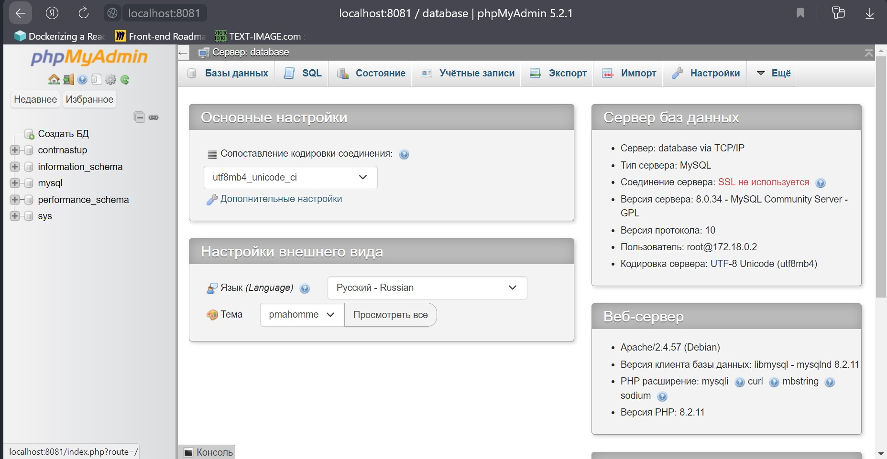

# Web database client PHPMyAdmin (PMA)

## Docker Desktop
Контейнер называется **pma** (*counteroffensive-pma*)

## Подключение через браузер
+ <a href="http://localhost:8081/" target="_blank">http://localhost:8080/</a>(Подключение напрямую)
Пример в браузере

## Просмотр данных в таблице
