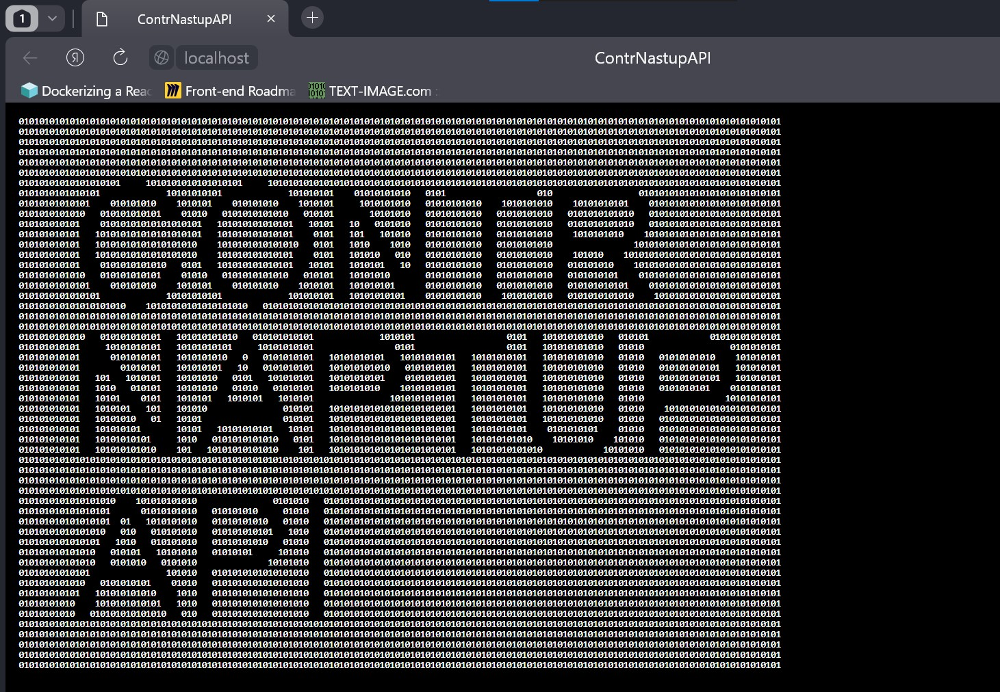
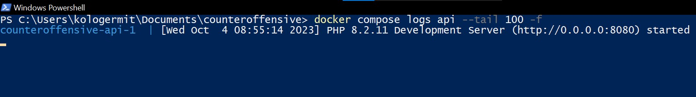
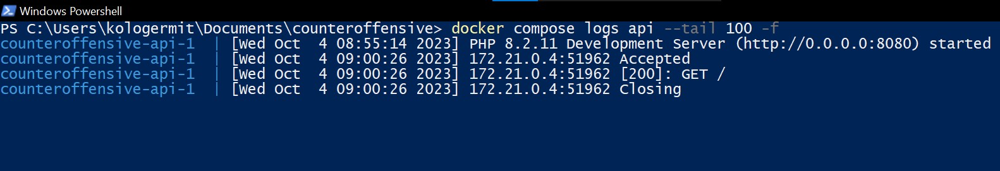
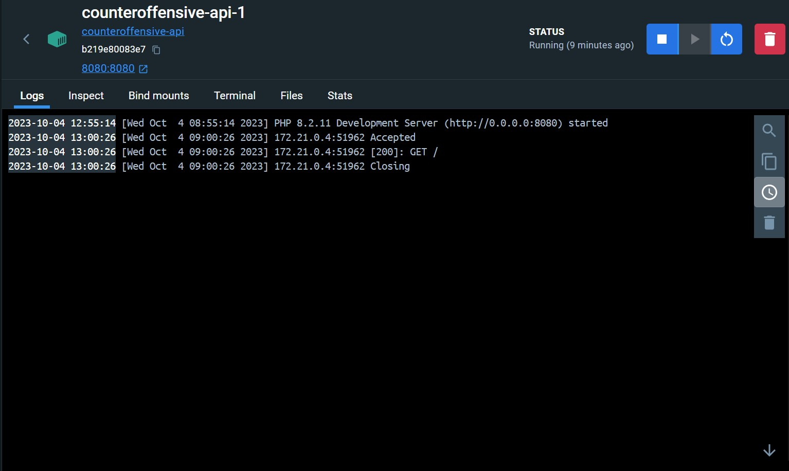
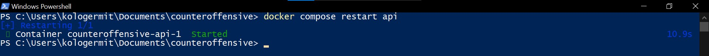
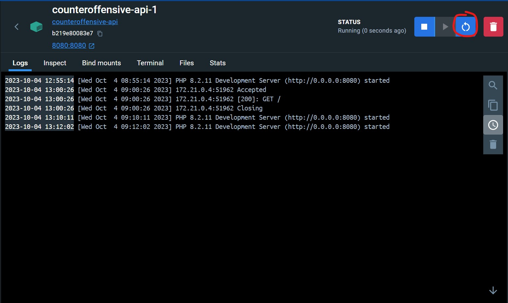
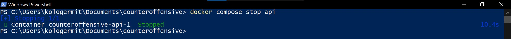
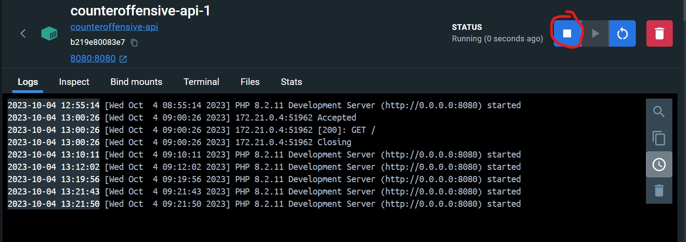

<<<<<<< HEAD
=======
# Документ с информацией о работе с PHP сервером (API)
## Оглавление
+ [Docker Desktop](#docker-desktop)
+ [Запуск](#start)
+ [Подключение через браузер](#browser-connection)
+ [Разработка](#dev)
+ [Просмотр логов](#logs-view)
+ [Дополинтельные действия с контейнером](#other-moves)
	+ [Перезапуск](#restart)
	+ [Остановка](#stop)
<a name="docker-desktop"></a>
## Docker Desktop
Контейнер называется **api** (*counteroffensive-api*)
<a name="start"></a>
## Запуск
Этот контейнер запускается вместе со всеми контейнерами и не требует перезапуска для обновления кода
<a name="browser-connection"></a>
## Подлючение через браузер
+ [http://localhost/api/](http://localhost/api/) (Поключение с через Nginx)
+ [http://localhost:8080/](http://localhost:8080/)

<a name="dev"></a>
## Разработка
+ Вся разработка ведётся в папке **server**. Это общая папка с контейнером. 
+ Запускаемые скрипты находятся в папке **server/public/**
+ Модели данный из БД находятся в папке **server/models/**
+ Файл с переменными окружения и другими конфигурационными данными находится в папке **server/config/**
+ Все библиотеки находятся в папке **server/libs/**. Внутренние библиотеки находятся в папке **server/libs/inside/**. Внешние библиотеки находятся в папке **server/libs/outside/**
<a name="logs-view"></a>
## Просмотр логов
+ Через команду (Вывод последних 100 строк вывода (*--tail 100*) и нахождение в выводе (*-f*))
```bash
docker compose logs api --tail 100 -f
```
Пример вывода в терминал только что запущенного контейнера

Пример вывода в терминал с несколькими сделанными запросами

+ Пример вывода в Docker Desktop 

<a name="other-moves"></a>
## Дополнительные действия с контейнером
<a name="restart"></a>
+ Перезапуск
Через терминал
```bash
docker compose restart api
```

Через Docker Desktop (Выделенная кнопка)

<a name="stop"></a>
+ Остановка
Через терминал
```bash
docker compose stop api
```

Через Docker Desktop (Выделенная кнопка)
<<<<<<< HEAD
<<<<<<< HEAD


<a name="logs-view"></a>
## Просмотр логов
+ Через команду (Вывод последних 100 строк вывода (*--tail 100*) и нахождение в выводе (*-f*))
```bash
docker compose logs api --tail 100 -f
```
Пример вывода в терминал только что запущенного контейнера

Пример вывода в терминал с несколькими сделанными запросами

+ Пример вывода в Docker Desktop 

>>>>>>> parent of 1b8bfd5 ([ADD] Начал писать документацию к БД DB.md)
=======

>>>>>>> parent of 17b72fc ([ADD] Написал документацию к клиенту CLIENT.md)
=======

>>>>>>> parent of bc4391a ([FIX] Закончил составление README.md)
